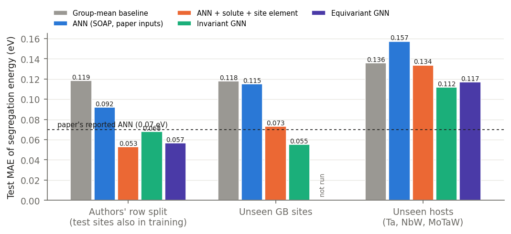
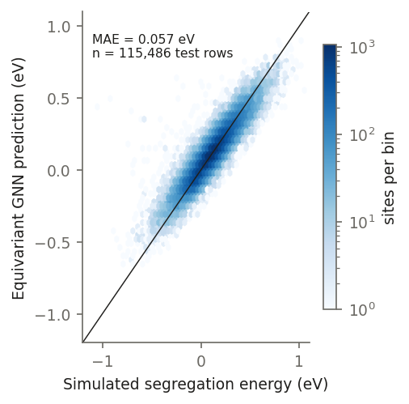
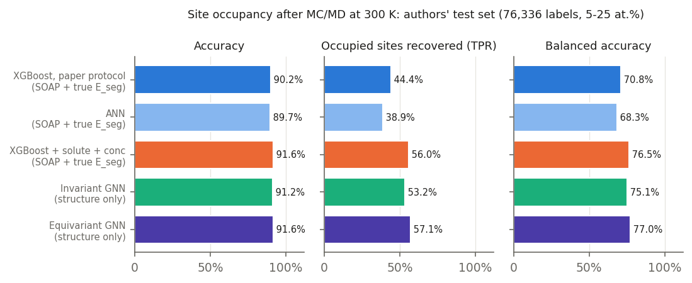

# Structure-only prediction of grain-boundary segregation in NbMoTaW with equivariant graph neural networks

*Author: (your name) · October 2026*

## Summary

The ML framework of Aksoy et al. (2024) predicts grain-boundary (GB) segregation in the refractory complex
concentrated alloy NbMoTaW in two steps:

1. an ANN predicts dilute-limit segregation energies from SOAP descriptors compressed by PCA;
2. XGBoost predicts site occupancy after Monte Carlo/molecular dynamics (MC/MD) from those descriptors plus the
   segregation energies.

We replace both descriptor-based models with E(3)-equivariant graph neural networks that read the relaxed atomic
structure directly. On the authors' own test sets:

- the GNN lowers the segregation-energy error from **0.07 to 0.057 eV**;
- it raises occupancy accuracy from **90.2 % to 91.6 %**, and the fraction of occupied sites it recovers from
  **45 % to 57 %**;
- it does this without the simulated segregation energies that the authors' occupancy model needs as input.

Two further findings:

- **The original splits leak.** Each site appears once per concentration, so every test label of the regression
  task also appears in training. We therefore add leak-free splits, on which the GNN's advantage holds or grows.
- **Unseen chemistry is hard.** Generalisation to an unseen host is limited by the small number of hosts (14), and
  fails for pure Ta.

## 1. Data

The dataset (Aksoy et al., *MSMSE* 32, 065011, 2024) contains:

- one 50 Å periodic polycrystal with four grains, built in 14 equiatomic hosts (Nb, Mo, Ta, W and their mixtures);
- simulations with the NbMoTaW moment-tensor potential (MTP);
- **76,278 segregation energies**: one per GB site per host–solute pair, 28 pairs in total;
- **1.16 M occupancy labels**: whether a solute sits on a GB site after hybrid MC/MD at 300 K, for solute
  concentrations of 5–95 %;
- **424 MC/MD final configurations**.

## 2. Method

**Model.** We use a NequIP-style message-passing network built with e3nn:

- spherical harmonics up to l = 2, three interaction layers and a 5 Å cutoff (the first three BCC shells);
- 64 k parameters, applied to the full periodic structure of about 7,000 atoms;
- an invariant variant (l = 0, 39 k parameters) as an ablation.

Task heads act on the per-atom embeddings:

- **Segregation energy** = h(site, solute) − h(bulk reference atom, solute). This is exactly the dataset's
  definition, E(solute at GB site) − E(solute at bulk reference), so per-host energy offsets cancel by construction.
- **Occupancy** = σ(g(site embedding, solute, concentration)). The input is the *undecorated* host, so the label
  cannot leak in through the structure.

Predictions are invariant to rotations to within 10⁻⁶ (checked).

**Baselines.** We retrain the authors' model families with their inputs on the same splits:

- ANN on the 10 SOAP-PCA components, and the same ANN with solute and site-element one-hots added;
- XGBoost on SOAP-PCA plus the true segregation energy, run with the authors' code settings;
- a group-mean baseline and a random-mixing baseline (occupancy probability = concentration).

Our XGBoost reproduction matches the published result: 90.2 % accuracy and 44.4 % true-positive rate (TPR),
against the reported 90.2 % and 45.2 %.

**Splits.**

| Split | Train / test | Leakage |
|---|---|---|
| Authors' | Their exact shuffled row splits, rebuilt from their scripts and mapped back to sites | Regression: 100 % of test labels have copies in training |
| Unseen sites | Disjoint GB sites | None |
| Unseen hosts | Test on Ta, NbW and MoTaW | None |
| Concentration | Train 5–30 %, test 40–50 % solute | None |

## 3. Results

### Segregation energy

| Model | Authors' split | Unseen sites | Unseen hosts |
|---|---|---|---|
| Group-mean baseline | 0.119 | 0.118 | 0.136 |
| ANN, SOAP (paper inputs) | 0.092 (reported: 0.07) | 0.115 | 0.157 |
| ANN + solute + site element | **0.053** | 0.073 | 0.134 |
| Invariant GNN | 0.068 | **0.055** | **0.112** |
| Equivariant GNN | 0.057 | — | 0.117 |

All values are test MAE in eV.

- **Authors' split:** the equivariant GNN reaches 0.057 eV (MSE 0.0064 eV², R² = 0.82), against the reported
  0.07 eV (MSE 0.01).
- **Solute identity matters.** The paper's ANN inputs do not encode the solute, so a site has identical inputs for
  four different targets. Adding the solute makes the ANN the best model on the leaky split.
- **On unseen sites the GNN wins clearly** (0.055 vs 0.073 eV). This is the setting that matters for new
  microstructures.

### Site occupancy

**Authors' test set** (76,336 labels at 5–25 % solute; 10,248 occupied):

| Model | Inputs | Accuracy | TPR | TNR | AUROC |
|---|---|---|---|---|---|
| XGBoost, paper protocol | SOAP + true E_seg | 90.2 % | 44.4 % | 97.3 % | 0.907 |
| ANN | SOAP + true E_seg | 89.7 % | 38.9 % | 97.6 % | 0.898 |
| XGBoost + solute + conc. | SOAP + true E_seg | 91.6 % | 56.0 % | 97.1 % | 0.936 |
| Invariant GNN | structure only | 91.2 % | 53.2 % | 97.1 % | 0.933 |
| **Equivariant GNN** | structure only | **91.6 %** | **57.1 %** | 96.9 % | **0.939** |

TPR is the fraction of occupied sites recovered and TNR the fraction of empty sites recovered. The equivariant
GNN's predicted GB solute fraction for each host, solute and concentration is within 1.1 percentage points of the
simulated value on average (invariant: 1.2).

**Unseen hosts and unseen concentrations:**

| Model | Unseen hosts: acc. / AUROC | Conc. 40–50 %: acc. / AUROC |
|---|---|---|
| Best trivial baseline | 78.9 % / 0.878 | 55.9 % / 0.68 |
| XGBoost (SOAP + true E_seg + solute + conc.) | **82.7 % / 0.916** | 73.4 % / 0.840 |
| ANN (same inputs) | 81.9 % / 0.906 | 75.0 % / 0.828 |
| Invariant GNN | 79.6 % / 0.897 | 75.5 % / 0.843 |
| Equivariant GNN | 79.1 % / 0.888 | **75.8 % / 0.851** |

**Unseen concentrations.** All learned models extrapolate far above the baselines. The GNNs over-predict filling
by 2–5 percentage points at 40–50 %, consistent with solute–solute repulsion that is never seen at low
concentration.

**Unseen hosts.** The descriptor models win here because they are given the *simulated* segregation energies of
the test host. The GNN predicts the alloy hosts well: within 3–10 percentage points of the GB solute fraction for
MoTaW and NbW. It fails on pure Ta, where solutes anti-segregate (simulated GB fraction 0.15 for Nb in Ta,
predicted 0.53). No training host shows this behaviour.

## 4. Discussion

1. **Structure alone is enough.** An equivariant GNN on the raw structure matches or beats descriptor models that
   are given simulated segregation energies. This removes the energy-calculation step from the prediction
   pipeline.
2. **Evaluation protocol matters as much as architecture.** Row-level random splits of duplicated site data reward
   memorisation: on the leaky split an ANN with chemistry information looks best. Site-, host- and
   concentration-held-out splits should be reported alongside them.
3. **Equivariance helps on seen chemistry, not on unseen hosts.** It reduces the error by 17 % on the authors'
   split, but is slightly worse than the invariant model on unseen hosts. With only 14 hosts, cross-chemistry
   generalisation is limited by data, not by the model.

**Limitations.**

- All labels come from one polycrystal at a single temperature (300 K).
- Occupancy labels are single MC/MD snapshots.
- The equivariant model was size-limited by a 4 GB GPU, and still underfits: its test error equals its training
  error on the leaky split.

## 5. Next steps

- A temperature–concentration benchmark: MC/MD ladders from 300 to 700 K in 25 K steps, with snapshot-averaged
  occupancy probabilities, to test extrapolation in temperature.
- More microstructures and hosts, to test cross-chemistry generalisation.
- Physics-informed occupancy heads: site energies and solute–solute interactions passed through Fermi–Dirac
  statistics.

## Acknowledgements

We thank Doruk Aksoy for providing the dataset.

## References

1. D. Aksoy, J. Luo, P. Cao, T. J. Rupert, *Modelling Simul. Mater. Sci. Eng.* **32**, 065011 (2024).
2. S. Yin et al., *Nat. Commun.* **12**, 4873 (2021). The NbMoTaW moment-tensor potential.
3. S. Batzner et al., *Nat. Commun.* **13**, 2453 (2022). NequIP.
4. M. Geiger, T. Smidt, e3nn: Euclidean neural networks, arXiv:2207.09453 (2022).
